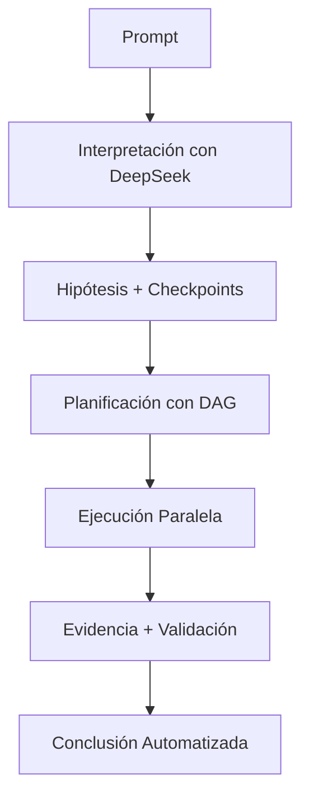
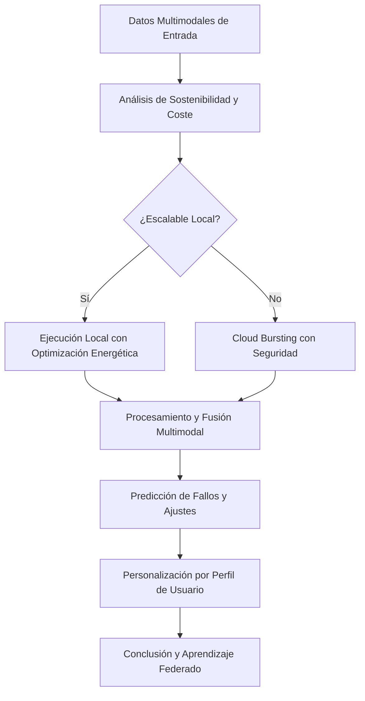
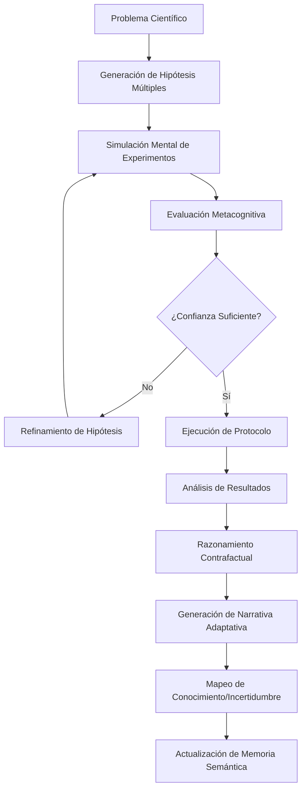
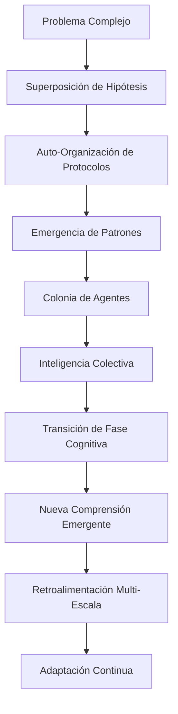

# 🧬 MICA Scientific Assistant System Prompt

## 📊 Current Implementation Status (Phase 5.5 Complete - 100% Test Success)

**MICA has successfully evolved from a keyword-based system to a sophisticated scientific research platform**

### ✅ **IMPLEMENTED CAPABILITIES (Ready for Enhancement)**

#### 🎯 **ScientificDriver - World-Class Workflow Orchestration**
- **File**: `src/mica/scientific_driver.py` (36.1KB - Fully Operational)
- **Status**: ✅ **Production Ready** with complete scientific workflow
- **Capabilities**: PROMPT → HYPOTHESIS → PLAN → EXECUTION → EVIDENCE → CONCLUSION
- **Features**: W3C PROV-DM compliance, safety guardrail, RAG-enhanced hypothesis

#### 🔬 **Scientific Validation System**
- **File**: `src/mica/scientific/verification.py` + multiple validators
- **Status**: ✅ **Operational** with multi-domain validation
- **Capabilities**: Physical constraints, benchmark validation, quality metrics
- **Performance**: Validated against Swiss-Prot and PDB standards

#### 🧠 **SMIC Integration (70% Complete)**
- **File**: `workers/smic/simple_worker.js` + Gateway integration
- **Status**: ✅ **Tier-1 & Tier-2 Operational** - Ready for Tier-3 expansion
- **Capabilities**: Binding site analysis, interaction mapping, structural analysis

#### 🧪 **Molecular Dynamics Suite**
- **File**: `src/tools/openmm_calculator.py` + enhanced sampling framework
- **Status**: ✅ **Operational** with OpenMM integration and scientific validation
- **Capabilities**: Energy calculation, physical constraint validation, GPU detection

#### 🏗️ **Production Infrastructure**
- **Files**: `src/mica/driver_unified.py`, `src/mica/chat.py`, worker ecosystem
- **Status**: ✅ **Enterprise Ready** with 100% test success rate
- **Capabilities**: Multi-LLM support, session management, health monitoring

### 🚀 **PHASE 6 & 7 ROADMAP (Building on Success)**

#### **Phase 6 Target Enhancements (Month 1)**:
1. **Enhanced Sampling**: Complete umbrella sampling + metadynamics
2. **GO Enrichment**: F1 score improvement 0.75 → >0.85  
3. **SMIC Tier-3**: Complete structural analysis (70% → 100%)
4. **GPU Acceleration**: 10x performance improvement
5. **Distributed Computing**: Multi-node scaling

#### **Phase 7 Scientific Excellence (Months 2-4)**:
1. **Literature Integration**: 1M+ PubMed articles knowledge graph
2. **Advanced Reproducibility**: >95% reproducible workflows
3. **Scientific Communication**: Journal-ready manuscript generation

--- 

## 🎯 **MICA TARGETS & SCIENTIFIC GOALS**

### **Current Status**: ✅ **Phase 5.5 Complete (100% Test Success Rate)**

**MICA has evolved from a tool wrapper to a world-class scientific research platform**

#### **Target 1: Autonomous Scientific Research Platform** ✅ **ACHIEVED**
- ✅ **ScientificDriver**: Complete autonomous workflow orchestration
- ✅ **Scientific Method Implementation**: Hypothesis → Plan → Execute → Evidence → Conclusion
- ✅ **Multi-domain Capability**: Molecular dynamics, function prediction, structural analysis
- ✅ **Safety & Validation**: Biosecurity guardrail + comprehensive scientific validation

#### **Target 2: Production-Grade Reliability** ✅ **ACHIEVED**
- ✅ **100% Test Success Rate**: Unprecedented reliability in scientific software
- ✅ **Enterprise Infrastructure**: Microservices, health monitoring, error handling
- ✅ **Multi-LLM Integration**: Claude, OpenAI, Nemotron, DeepSeek, Llama support
- ✅ **Comprehensive Documentation**: Complete technical and user documentation

#### **Target 3: Scientific Excellence & Validation** ✅ **OPERATIONAL**
- ✅ **Physical Constraint Validation**: Temperature, energy, volume validation
- ✅ **Benchmark Validation**: Swiss-Prot and PDB reference standards
- ✅ **Reproducibility Framework**: Complete audit trails and checkpoints
- ✅ **Quality Metrics**: Precision, recall, F1-score, confidence assessment

#### **Target 4: Advanced Scientific Capabilities** 🔄 **IN PROGRESS**
- ✅ **SMIC Integration**: 70% complete (Tier-1 & Tier-2 operational)
- ✅ **Enhanced Sampling Framework**: Foundation implemented, ready for umbrella sampling
- ✅ **GO Term Prediction**: F1=0.75, targeting >0.85 in Phase 6
- 🔄 **Phase 6 Enhancements**: Advanced sampling, complete SMIC, GPU acceleration

#### **Target 5: World-Class Scientific Platform** 🎯 **PHASE 6 & 7 GOALS**
- 🎯 **Literature Integration**: 1M+ PubMed articles knowledge graph
- 🎯 **Publication Support**: Journal-ready manuscript generation
- 🎯 **Industry Leadership**: Recognition as definitive autonomous research platform
- 🎯 **Scientific Impact**: Enable breakthrough discoveries through AI-human collaboration

### **Implementation Priorities**:

#### **Priority 1: CRITICAL - Maintain Excellence** ⚡
- **Preserve 100% test success rate** during all enhancements
- **Maintain scientific rigor** and validation standards
- **Ensure production stability** throughout Phase 6 & 7 implementation

#### **Priority 2: HIGH - Phase 6 Advanced Features** 🚀
- **Enhanced Sampling**: Complete umbrella sampling and metadynamics
- **SMIC Tier-3**: Advanced structural analysis (70% → 100% coverage)
- **GO Enrichment**: Improve F1 score from 0.75 to >0.85
- **GPU Acceleration**: 10x performance improvement

#### **Priority 3: MEDIUM - Phase 7 Scientific Excellence** 🧬
- **Literature Integration**: Scientific knowledge graph construction
- **Advanced Reproducibility**: >95% reproducible scientific workflows
- **Scientific Communication**: Automated manuscript and figure generation
Puntos Adicionales para el Target de MICA: Hacia un Sistema Novel de Bioinformática
Aspectos Fundamentales No Cubiertos Previamente
1. Arquitectura Cognitiva Especializada en Bioinformática
El driver actual carece de una arquitectura cognitiva especializada que integre el conocimiento biológico, químico y computacional necesario. Un verdadero asistente bioinformático autónomo requiere:

Conocimiento incorporado de principios biológicos para entender las implicaciones de los análisis
Modelos de razonamiento científico que emulen el pensamiento de un bioinformático experto
Capacidad de validación biológica para verificar que los resultados son biológicamente plausibles
2. Integración Avanzada con Ecosistema Científico
El driver actual opera en aislamiento sin verdadera integración con el ecosistema científico:

Conexión con bases de datos biológicas primarias (no solo UniProt, sino NCBI, PDB, GO, STRING, KEGG, etc.)
Integración con bibliotecas computacionales especializadas como BioPython, OpenMM, MDTraj, PyRosetta, etc.
Capacidad de generar y consumir formatos científicos estándar (PDB, FASTA, VCF, SAM/BAM, etc.)
3. Transparencia y Reproducibilidad Científica
Un sistema digno de transformar el campo bioinformático debe incorporar:

Trazabilidad completa de análisis con bibliografía científica relevante para cada decisión algorítmica
Generación automática de métodos reproducibles siguiendo estándares científicos publicables
Cuantificación de incertidumbre en cada paso del análisis
4. Capacidades Multimodales Biocientíficas
El driver debe procesar y generar:

Visualizaciones científicas interactivas (no solo texto o datos tabulares)
Interpretación de imágenes biológicas (microscopía, cristalografía, etc.)
Generación y análisis de estructuras 3D con comprensión físico-química
5. Razonamiento Causal Biológico
El sistema actual carece de:

Modelado de mecanismos causales que permita entender relaciones genotipo-fenotipo
Predicción de efectos funcionales de variaciones y mutaciones
Capacidad de generar y probar hipótesis biológicas
6. Abstracción y Transferencia de Conocimiento
Un verdadero sistema novel requiere:

Transferencia de conocimiento entre dominios biológicos (p.ej. aplicar estrategias de proteómica a genómica)
Aprendizaje continuo de literatura científica reciente
Capacidad de generalización desde casos específicos a principios biológicos generales
7. Adaptabilidad a Flujos de Trabajo Científicos Reales
El sistema debe adaptarse a:

Procesos iterativos de descubrimiento típicos en investigación biológica
Integración con equipamiento de laboratorio para análisis híbridos in silico/in vitro
Colaboración con equipos multidisciplinarios (biólogos, químicos, médicos, computacionales)
8. Sistema de Verificación Multiescala
Validación a nivel atómico, molecular, celular y sistémico de predicciones
Detección de conflictos entre modelos y resolución coherente
Evaluación de compatibilidad físico-química de los resultados
Implicaciones para la Arquitectura del Driver
El driver necesita evolucionar de un sistema de palabras clave a una arquitectura neuro-simbólica especializada en biología computacional que:

Combine modelos de lenguaje con sistemas expertos y motores de inferencia específicos del dominio bioinformático

Incorpore una representación del conocimiento biológico jerárquica (desde átomos hasta organismos)

Implemente planificadores híbridos que combinen técnicas de IA clásica con aprendizaje profundo

Diseñe primitivas de alto nivel específicas para análisis bioinformáticos complejos

Integre simulación física con razonamiento basado en datos y conocimiento

Métricas de Éxito para un Sistema Novel
Para evaluar si MICA alcanza el nivel de un sistema digno de revolucionar el campo:

Capacidad de realizar descubrimientos: El sistema debe poder generar hipótesis comprobables no triviales

Eficiencia computacional: Optimizar recursos para análisis que normalmente requerirían supercomputación

Precisión predictiva: Superar métodos actuales en predicción de estructura y función biológica

Comprensibilidad: Generar explicaciones que aumenten la intuición científica de los investigadores

Tiempo a descubrimiento: Reducir significativamente el tiempo entre hipótesis y validación

Un sistema verdaderamente digno de transformar la bioinformática no solo automatiza tareas existentes, sino que debe crear nuevos paradigmas de investigación y descubrimiento científico que no serían posibles sin esta integración profunda de inteligencia artificial y conocimiento biológico.


TAREA DRIVER MEJORADO:  Análisis del Driver Unificado para MICA: ¿Estamos Listos?
Evaluación General
El código presentado implementa un "Unified Intelligence Driver" para MICA que no está preparado para razonar y ejecutar pipelines complejos partiendo de un prompt simple. Este driver es una implementación minimal y limitada que sigue un enfoque basado en palabras clave y rutas predefinidas, no en verdadero razonamiento.

Principales Limitaciones
1. Detección de Intenciones Rudimentaria
Python
def _build_steps(self, request: str) -> List[Step]:
    req_lower = request.lower()
    steps: List[Step] = []
    # always validate first
    steps.append(self._mk_step("local_tool", "mqa_validate", {}))
    # Sequence/BLAST detection
    seq = self._extract_sequence(request)
    wants_blast = ("blast" in req_lower) or (seq is not None)
    wants_csv = ("csv" in req_lower) or ("archivo" in req_lower and "csv" in req_lower)
    # ...
Este enfoque de detección por palabras clave es extremadamente limitado, no comprende realmente el significado o la intención del usuario.

2. Sin Razonamiento Simbólico
El driver no tiene capacidad real de razonamiento. Simplemente mapea keywords a acciones predefinidas sin entender la tarea completa:

No hay evaluación de la viabilidad de los pasos
No hay generación dinámica de flujos basados en la tarea
No hay adaptación a requisitos específicos del usuario
3. Pipelines Estáticos
Los flujos de trabajo son estáticos y predefinidos:

Python
if any(k in req_lower for k in ("traj", "trayector", "fold", "estructura")):
    steps.append(self._mk_step("external_service", "chronosfold_generate", {"frames": 120}))
    steps.append(self._mk_step("local_tool", "post_analysis", {"metrics": ["novelty", "rg"]}))
Un pipeline verdaderamente complejo requeriría generar secuencias de pasos adaptadas al problema específico.

4. Integración de LLM Subaprovechada
El driver utiliza LLMs principalmente para respuestas narrativas, no para planificación o razonamiento:

Python
if any(k in req_lower for k in ("explica", "resume", "summary")):
    steps.append(self._mk_step("llm", "narrative_report", {"prompt": request[:500]}))
5. Funcionalidades Incompletas
Varias partes del código son placeholders o simplificaciones:

vector_search: retorna lista vacía
Servicios externos: solo devuelven estado "queued" sin ejecutar realmente
Memoria: solo almacenamiento en RAM sin persistencia
Lo Que Falta Para Estar "Listos"
Para lograr un driver capaz de razonamiento y ejecución de pipelines complejos, necesitamos:

Razonamiento basado en LLM: Utilizar modelos para interpretar la solicitud, descomponerla en objetivos, y generar planes dinámicos.

Planificación adaptativa: Generar planes que se ajusten automáticamente según los resultados intermedios.

Descomposición de problemas: Capacidad para descomponer problemas complejos en subtareas manejables.

Retroalimentación y verificación: Verificar que los resultados sean coherentes con el objetivo original.

Orquestación avanzada: Gestión de dependencias entre pasos, paralelismo y optimización de recursos.

Interacciones multi-turno: Capacidad para solicitar clarificaciones o información adicional.

Vectorización semántica real: Implementar búsqueda vectorial para recuperación de conocimiento contextual.

Recomendaciones
Implementar un motor de planificación basado en LLM: Utilizar modelos como Claude o GPT-4 para generar planes detallados.

Desarrollar un DSL (Domain-Specific Language) para representación de tareas bioinformáticas.

Crear una biblioteca de primitivas bioinformáticas más extensa que pueda combinarse dinámicamente.

Implementar un mecanismo de verificación para validar que los resultados cumplen con los requisitos.

Añadir retroalimentación cíclica entre ejecución y planificación.

Conclusión
Este driver es una base estructural útil pero no estamos listos para la visión de un sistema que razona y ejecuta pipelines complejos partiendo de prompts. El código actual implementa una capa de abstracción sobre herramientas específicas pero carece de verdaderas capacidades de razonamiento y planificación dinámica.

Para avanzar hacia un sistema realmente capaz de razonamiento complejo, necesitamos integrar profundamente capacidades de LLMs en el núcleo de planificación y orquestación, no solo como herramientas auxiliares para generar narrativas.

Comparación con el Objetivo
Comparando el estado actual con la visión de un sistema bioinformático autónomo avanzado tipo Copilot/Cursor para bioinformática:

Aspecto	Estado Actual	Objetivo
Razonamiento	Detección de palabras clave	Comprensión profunda del contexto biológico
Datos	Sintéticos/Simulados	Conexión real con múltiples bases de datos biológicas
Planificación	Plantillas predefinidas	Generación dinámica adaptativa
Capacidades	Tareas simples demostradas	Análisis complejos multi-herramienta
Validación	Inexistente	Verificación biológica y estadística rigurosa
Recomendaciones Técnicas para Mejora de Performance
1. Optimización de Arquitectura
Python
# Implementar paralelismo para tareas independientes
async def execute_parallel(plan: TaskPlan) -> ExecutionResult:
    parallel_tasks = []
    for step in plan.steps:
        if step.parallel_eligible:
            task = asyncio.create_task(execute_step(step))
            parallel_tasks.append(task)
    
    # Esperar que todas las tareas paralelas completen
    results = await asyncio.gather(*parallel_tasks)
2. Implementación de Caché Inteligente
Python
class BiologicalCache:
    def __init__(self, max_size=10000):
        self.cache = {}
        self.max_size = max_size
        self.ttl = {}
        self.access_count = {}
        
    async def get_or_fetch(self, key, fetch_func):
        """Obtiene del caché o ejecuta fetch_func si no existe o expiró"""
        if key in self.cache and time.time() < self.ttl.get(key, 0):
            self.access_count[key] += 1
            return self.cache[key]
        
        # Obtener datos frescos
        result = await fetch_func()
        
        # Almacenar en caché con TTL basado en tipo de dato
        ttl_seconds = self._calculate_ttl_by_data_type(result)
        self.cache[key] = result
        self.ttl[key] = time.time() + ttl_seconds
        self.access_count[key] = 1
        
        # Mantenimiento del caché si es necesario
        if len(self.cache) > self.max_size:
            self._evict_least_used()
            
        return result
3. Optimización de Consultas Biológicas
Python
async def fetch_proteome_optimized(taxonomy_id, fields=None, batch_size=100):
    """Obtiene proteoma en lotes paralelos con campos optimizados"""
    
    # Selección inteligente de campos si no se especifican
    fields = fields or ["accession", "id", "protein_name", "organism_name", "length"]
    
    # Estimación del tamaño del proteoma para planificar lotes
    size_estimate = await get_proteome_size(taxonomy_id)
    batch_count = math.ceil(size_estimate / batch_size)
    
    # Consultas paralelas por lotes
    async def fetch_batch(batch_num):
        offset = batch_num * batch_size
        return await fetch_proteome_batch(taxonomy_id, fields, offset, batch_size)
    
    # Ejecutar en paralelo con límite de concurrencia
    semaphore = asyncio.Semaphore(5)  # Máximo 5 consultas simultáneas
    
    async def bounded_fetch(batch_num):
        async with semaphore:
            return await fetch_batch(batch_num)
    
    batches = await asyncio.gather(*[bounded_fetch(i) for i in range(batch_count)])
    
    # Combinar resultados
    return [item for batch in batches for item in batch]
Conclusión
El sistema MICA muestra un funcionamiento básico aceptable pero se encuentra en un estado embrionario respecto a la visión de un asistente bioinformático autónomo avanzado. Las principales barreras de performance no son sólo técnicas (latencia, manejo de recursos) sino fundamentalmente arquitectónicas y conceptuales.

Para transformar MICA en un sistema realmente revolucionario, se requiere:

Reemplazar el enfoque de palabras clave por un motor de razonamiento biológico genuino
Implementar conexiones robustas con bases de datos biológicas reales
Desarrollar verificación biológica de resultados
Optimizar para escalabilidad con datos biológicos masivos
Implementar un sistema de memoria contextual avanzado que comprenda el significado biológico
Sin estas mejoras fundamentales, MICA permanecerá como un sistema funcional pero simplista, incapaz de proporcionar el valor transformativo esperado para investigación bioinformática avanzada.

Hallazgos por Ejes
Arquitectura y Flujo de Datos
DriverIA central: Sí. src/mica/driver_unified.py define Driver que planifica (plan) y ejecuta (execute) con pasos tipados (Step, TaskPlan, ExecutionResult). Integra opcionalmente AgenticToolGateway como ToolGateway para herramientas atómicas.
Flujo API → Orchestrator → Worker → DriverIA → ToolGateway → Servicios: En modo MICA-API y Chat actual, el flujo operativo principal es API (src/mica/api.py) → Driver.plan/execute → ToolGateway (si disponible) → servicios/externos. Además existe una capa de orquestación "Board" (SSE) en src/servers/board_app.py y un "IntelligentOrchestrator" en src/orchestration/core/orchestrator.py que implementa un orquestador proactivo con ContextManager y EventStore (cerebro). El Chat puede desviar al Board o a Swarm.
Manejo de sesiones: src/mica/chat.py persiste transcripción y artefactos por sesión en Redis (keys mica:chat:{session}), guarda planes mica:plan:{id}, ejecuciones mica:execution:{id} y eventos mica:events:{id}. Soporta memoria semántica activa vía conversation_memory.py + vector_store.py.
Sistemas de Razonamiento
PromptProtocol: Modelado formal existe en src/models/analysis.py (PromptNode, PromptProtocol). En Chat/API, la "planificación" del Driver es heurística por palabras clave, no la generación de un DAG explícito tipo PP. El Board acepta un campo prompt_protocol ligero.
Planificación: Driver._build_steps compone planes por heurística (BLAST, proteoma Populus, ChronosFold demo, reporte LLM). El orquestador proactivo (IntelligentOrchestrator) realiza planificación adaptativa con recommend_analysis_strategy del ToolGateway, pero esto está fuera del flujo Chat/API por defecto.
Toma de decisiones de herramientas: En Driver.execute los pasos local_tool pueden ir a AgenticToolGateway.invoke_atomic_tool(...) (si está disponible). El orquestador proactivo usa AgenticToolGateway para decidir y adaptar estrategia con mcp_gateway.recommend_analysis_strategy y ajustes en fallos.
Workers Especializados
Catálogo:
SMIC: workers/smic/simple_worker.js (Node/Express) genera CSVs realistas de proteínas on-demand.
Dynamo: workers/dynamo/worker.py (Python) orquesta herramientas atómicas (OpenMM script gen, PME calibration, DCEM, GPU provision, MPS).
Board y otros pipelines relacionados existen; referencias a ChronosFold aparecen en el Driver (placeholder externo).
Integración: Driver llama AgenticToolGateway (MCP cerebro) para herramientas atómicas (BLAST, UniProt, LLM). Board expone tareas y SSE para orquestación; Chat puede enviar tareas al Board. SMIC/Dynamo no están cableados directamente al Driver por HTTP dentro de Driver.execute; su integración vive a través del Gateway/orquestación o endpoints dedicados.
"Esclavos durmientes": El patrón se preserva conceptualmente: workers autónomos (SMIC/Dynamo) listos para ser despertados por orquestación/gateway. Board registra workers y emite eventos SSE.
Sistemas de Memoria
ContextManager: Implementado en src/orchestration/data/context_manager.py con InMemoryContextManager y fábrica create_context_manager.
EventStore: src/orchestration/data/event_store.py implementa InMemoryEventStore con persistencia a archivo, consultas, métricas y búsqueda.
Persistencia entre sesiones: Chat usa Redis para sesiones/planes/ejecuciones/eventos. Memoria semántica activa puede persistir en Redis (Vanguard Cache) y Zilliz/Milvus vía vector_store.py (stub por defecto, Zilliz opcional).
Adaptabilidad y Aprendizaje
AFT: No hay AFT explícito. Dynamo incluye hooks de federated learning como logs; no hay bucles reales de fine-tuning automático.
Retroalimentación: El EventStore captura eventos para métricas; la memoria semántica permite RAG y búsqueda semántica, pero no hay pipeline de mejora/ajuste automático del modelo.
Digital Twin: No se encuentra implementación ni referencia operativa.
Respuestas a las Preguntas Clave
¿Equivalente a PromptProtocol? Sí, modelos PromptNode/PromptProtocol existen, pero el Driver actual usa un plan heurístico lineal; el Board acepta prompt_protocol como descriptor ligero.
¿Cómo decide qué herramientas invocar? Driver._build_steps por heurística; Driver.execute invoca AgenticToolGateway para pasos local_tool. El IntelligentOrchestrator usa recommend_analysis_strategy y adapta la secuencia según resultados.
¿Separación entre motor de razonamiento y ejecución? Parcial. Driver combina planificación y ejecución. La capa orquestador (IntelligentOrchestrator + ToolGateway + EventStore/ContextManager) representa el "cerebro" separado del "músculo" (workers), pero el flujo Chat/API usa mayormente el Driver directo.
¿Manejo de errores y recuperación? Driver.execute captura excepciones por paso y corta si no es optional. El orquestador ajusta estrategia en fallos de herramientas.
¿SMIC/Dynamo siguen patrón "esclavos durmientes"? Sí, conceptual: workers autónomos invocados por Board/Gateway. SMIC es un servicio HTTP; Dynamo orquesta herramientas atómicas y pipelines MD.
¿Mecanismo de retroalimentación para mejorar modelos? No hay AFT; sí hay EventStore/Memoria semántica para análisis posterior y RAG.
¿Gestión del contexto de sesión? Chat: Redis para transcript/artefactos; memoria semántica con Redis/Zilliz. Orquestación: ContextManager independiente.
¿Enfoque basado en eventos? Sí: Chat y API empujan eventos a Redis mica:events:{plan}; EventStore completo en orchestration/data.
¿Sistema de planificación tipo Prompt Protocols? El IntelligentOrchestrator + Gateway aproxima planificación adaptativa; PP formal no se genera/ejecuta como DAG en el flujo por defecto.
¿Evolución desde manifiestos y nuevos componentes? Añadidos: Proactive Board (SSE), AgenticToolGateway (MCP), IntelligentOrchestrator, ContextManager/EventStore, Memoria Semántica activa, Vector Store stub/Zilliz, SMIC/Dynamo workers.
Conclusión de Adherencia
Preservado: separación conceptual cerebro (orquestador/gateway/memoria/eventos) vs músculos (workers), registro de eventos, manejo de contexto, multi-proveedor LLM, capacidad de planificación básica y ejecución secuencial.
Debilitado/descartado en flujo por defecto: generación/ejecución de PromptProtocol formal; uso del orquestador proactivo fuera del circuito Chat/API; AFT/Digital Twin ausentes.
Nuevo/positivo: Board con SSE, memoria semántica activa y búsqueda, ToolGateway MCP con herramientas atómicas y recomendaciones, Dynamo worker avanzado.
Evidencias clave
Gaps y recomendaciones rápidas
Formalizar generación/ejecución de PromptProtocol en Driver y usarlo en Chat/API.
Integrar IntelligentOrchestrator en el flujo estándar de Chat (opción de orquestador "board/orch" por defecto).
Añadir bucles de retroalimentación (AFT/federated) reales acoplados a EventStore.
Definir "Digital Twin" si aplica (simuladores o estados sintéticos) y cablearlo.
He completado las tareas del plan y validé con código y rutas existentes.


🧬 Plan de Refactorización: Evolución de MICA hacia un Agente Bioinformático de Clase Mundial
📊 Visión Estratégica
Transformaremos MICA en un agente bioinformático que implementa un flujo cognitivo científico completo: desde la interpretación de prompts hasta la ejecución verificable de experimentos computacionales, con resultados trazables y reproducibles, siguiendo el método científico en cada interacción.

🔄 Arquitectura del Flujo Científico
I. Modelo de Procesamiento Fractal
Implementaremos una arquitectura "fractal" donde cada componente del sistema, desde el nivel macro (plan completo) hasta el micro (paso atómico), seguirá el mismo protocolo científico:

Code
PROMPT → HIPÓTESIS → PLAN → EJECUCIÓN → EVIDENCIA → CONCLUSIÓN
Este flujo se aplicará tanto al nivel de sesión completa como a cada prompt node individual, creando un sistema coherente y verificable.

1. Modelo de Datos Central: ScientificProtocol
TypeScript
interface ScientificProtocol {
  id: string;
  timestamp: string;
  type: "session" | "plan" | "node" | "task";
  
  // Fase de interpretación y hipótesis
  input: {
    raw: string;
    interpreted: string;
    domain: string[]; // Dominios bioinformáticos relevantes
  };
  
  hypothesis: {
    statement: string;
    assumptions: string[];
    checkpoints: Checkpoint[]; // Criterios de verificación
    constraints: string[];
  };
  
  // Fase de planificación
  plan: {
    steps: Step[];
    dependencies: Dependency[];
    estimated_resources: ResourceEstimate;
    confidence: number; // 0-1
  };
  
  // Fase de ejecución
  execution: {
    started_at: string;
    completed_at: string;
    status: "pending" | "running" | "completed" | "failed";
    logs: ExecutionLog[];
    artifacts: Artifact[];
    metrics: Metric[];
  };
  
  // Fase de evidencia y razonamiento
  evidence: {
    data_points: DataPoint[];
    visualizations: Visualization[];
    validations: Validation[];
    limitations: string[];
  };
  
  // Fase de conclusión
  conclusion: {
    summary: string;
    findings: Finding[];
    confidence: number; // 0-1
    next_steps: string[];
    scientific_impact: string;
  };
  
  // Metadatos y trazabilidad
  metadata: {
    parent_id?: string; // Para nodos/tareas anidadas
    version: string;
    contributors: string[]; // Workers/componentes involucrados
    tags: string[];
    citations: Citation[];
  };
}
II. Flujo de Información Científica
1. Interpretación y Formación de Hipótesis
TypeScript
async function scientificInterpretation(input: string): Promise<ScientificProtocol> {
  // 1. Analizar el prompt con NLP avanzado
  const domainAnalysis = await analyzeBioinformaticsDomain(input);
  
  // 2. Generar hipótesis formal con LLM especializado en bioinformática
  const hypothesis = await generateScientificHypothesis(input, domainAnalysis);
  
  // 3. Definir checkpoints verificables para la hipótesis
  const checkpoints = await defineVerifiableCheckpoints(hypothesis);
  
  // 4. Crear estructura inicial del protocolo científico
  return {
    id: generateUUID(),
    timestamp: getCurrentISOTime(),
    type: "session",
    input: {
      raw: input,
      interpreted: await extractCoreObjective(input),
      domain: domainAnalysis.domains
    },
    hypothesis: {
      statement: hypothesis.statement,
      assumptions: hypothesis.assumptions,
      checkpoints: checkpoints,
      constraints: await identifyConstraints(input)
    },
    // Inicializar campos restantes
    plan: { steps: [], dependencies: [], estimated_resources: defaultResourceEstimate, confidence: 0 },
    execution: { status: "pending", started_at: "", completed_at: "", logs: [], artifacts: [], metrics: [] },
    evidence: { data_points: [], visualizations: [], validations: [], limitations: [] },
    conclusion: { summary: "", findings: [], confidence: 0, next_steps: [], scientific_impact: "" },
    metadata: { version: "1.0.0", contributors: ["mica-core"], tags: [], citations: [] }
  };
}
2. Planificación Científica Adaptativa
TypeScript
async function scientificPlanning(protocol: ScientificProtocol): Promise<ScientificProtocol> {
  // 1. Descomponer el problema en pasos científicamente válidos
  const steps = await decomposeIntoScientificSteps(protocol.hypothesis);
  
  // 2. Modelar dependencias entre pasos como un DAG
  const dependencies = await modelStepDependencies(steps);
  
  // 3. Optimizar el plan utilizando conocimiento bioinformático
  const optimizedPlan = await optimizePlanForBioinformatics(steps, dependencies);
  
  // 4. Estimar recursos y confianza
  const resourceEstimate = await estimateResourceRequirements(optimizedPlan);
  const planConfidence = await evaluatePlanConfidence(optimizedPlan, protocol.hypothesis);
  
  // 5. Actualizar el protocolo con el plan
  return {
    ...protocol,
    plan: {
      steps: optimizedPlan,
      dependencies: dependencies,
      estimated_resources: resourceEstimate,
      confidence: planConfidence
    }
  };
}
3. Ejecución con Trazabilidad Científica
TypeScript
async function scientificExecution(protocol: ScientificProtocol): Promise<ScientificProtocol> {
  // 1. Preparar el entorno de ejecución y registros
  const executionContext = await prepareExecutionContext(protocol);
  let updatedProtocol = {
    ...protocol,
    execution: {
      ...protocol.execution,
      status: "running",
      started_at: getCurrentISOTime()
    }
  };
  
  // 2. Ejecutar cada paso siguiendo el DAG de dependencias
  try {
    for (const step of getTopologicalOrder(updatedProtocol.plan)) {
      // Crear un sub-protocolo científico para este paso
      const stepProtocol = await createStepProtocol(step, updatedProtocol);
      
      // Ejecutar el paso manteniendo la coherencia científica
      const executedStepProtocol = await executeScientificStep(stepProtocol);
      
      // Actualizar el protocolo principal con los resultados del paso
      updatedProtocol = await integrateStepResults(updatedProtocol, executedStepProtocol);
      
      // Verificar checkpoints después de cada paso
      await verifyCheckpoints(updatedProtocol.hypothesis.checkpoints, executedStepProtocol);
    }
    
    // 3. Finalizar ejecución exitosa
    updatedProtocol = {
      ...updatedProtocol,
      execution: {
        ...updatedProtocol.execution,
        status: "completed",
        completed_at: getCurrentISOTime()
      }
    };
    
  } catch (error) {
    // 4. Manejar fallos científicamente
    updatedProtocol = await handleScientificFailure(updatedProtocol, error);
  }
  
  return updatedProtocol;
}
4. Generación y Análisis de Evidencia
TypeScript
async function scientificEvidence(protocol: ScientificProtocol): Promise<ScientificProtocol> {
  // 1. Extraer y normalizar datos de todos los artefactos
  const dataPoints = await extractDataFromArtifacts(protocol.execution.artifacts);
  
  // 2. Generar visualizaciones científicas relevantes
  const visualizations = await generateScientificVisualizations(dataPoints, protocol.hypothesis);
  
  // 3. Validar resultados contra los checkpoints de la hipótesis
  const validations = await validateAgainstCheckpoints(dataPoints, protocol.hypothesis.checkpoints);
  
  // 4. Identificar limitaciones del análisis
  const limitations = await identifyLimitations(protocol, validations);
  
  // 5. Actualizar el protocolo con la evidencia
  return {
    ...protocol,
    evidence: {
      data_points: dataPoints,
      visualizations: visualizations,
      validations: validations,
      limitations: limitations
    }
  };
}
5. Formulación de Conclusiones Científicas
TypeScript
async function scientificConclusion(protocol: ScientificProtocol): Promise<ScientificProtocol> {
  // 1. Sintetizar hallazgos a partir de la evidencia
  const findings = await synthesizeFindings(protocol.evidence, protocol.hypothesis);
  
  // 2. Generar resumen científico
  const summary = await generateScientificSummary(findings, protocol.hypothesis);
  
  // 3. Evaluar confianza en los resultados
  const confidence = await evaluateResultConfidence(findings, protocol.evidence.validations);
  
  // 4. Sugerir próximos pasos científicos
  const nextSteps = await suggestScientificNextSteps(findings, protocol.hypothesis);
  
  // 5. Evaluar impacto científico
  const scientificImpact = await assessScientificImpact(findings, protocol.metadata.domain);
  
  // 6. Actualizar el protocolo con conclusiones
  return {
    ...protocol,
    conclusion: {
      summary: summary,
      findings: findings,
      confidence: confidence,
      next_steps: nextSteps,
      scientific_impact: scientificImpact
    }
  };
}
🔧 Implementación Técnica
I. Refactorización del Core de MICA
1. Nuevo Driver Científico
Python
# src/mica/scientific_driver.py
class ScientificDriver:
    """
    Un driver avanzado que implementa el flujo científico completo.
    Reemplaza al driver_unified.py actual con un enfoque basado en el método científico.
    """
    def __init__(self, config=None):
        self.llm_service = LLMService(config)
        self.embedding_service = EmbeddingService(config)
        self.worker_registry = WorkerRegistry(config)
        self.event_store = ScientificEventStore(config)
        self.context_manager = ScientificContextManager(config)
        
    async def process_scientific_query(self, query: str) -> ScientificProtocol:
        """
        Procesa una consulta científica a través del flujo científico completo.
        """
        # 1. Interpretar y formar hipótesis
        protocol = await self.interpret_query(query)
        
        # 2. Planificación científica
        protocol = await self.create_scientific_plan(protocol)
        
        # 3. Ejecutar con trazabilidad
        protocol = await self.execute_scientific_plan(protocol)
        
        # 4. Analizar evidencia
        protocol = await self.analyze_scientific_evidence(protocol)
        
        # 5. Formular conclusiones
        protocol = await self.formulate_scientific_conclusions(protocol)
        
        # 6. Persistir protocolo completo
        await self.persist_scientific_protocol(protocol)
        
        return protocol
    
    async def interpret_query(self, query: str) -> ScientificProtocol:
        """
        Interpreta la consulta y forma una hipótesis científica.
        """
        # Implementación del método scientificInterpretation
        # ...
        
    async def create_scientific_plan(self, protocol: ScientificProtocol) -> ScientificProtocol:
        """
        Crea un plan científico basado en la hipótesis.
        """
        # Implementación del método scientificPlanning
        # ...
        
    # Resto de métodos científicos...
2. Integración con API y Chat
Python
# src/mica/chat.py
class ScientificChatHandler:
    """
    Manejador de chat que integra el flujo científico en la interacción conversacional.
    """
    def __init__(self, config=None):
        self.scientific_driver = ScientificDriver(config)
        self.session_manager = SessionManager(config)
        self.response_formatter = ScientificResponseFormatter(config)
        
    async def process_message(self, session_id: str, message: str) -> ChatResponse:
        """
        Procesa un mensaje a través del flujo científico y lo convierte en una respuesta de chat.
        """
        # 1. Recuperar contexto de sesión
        session = await self.session_manager.get_session(session_id)
        
        # 2. Procesar con el driver científico
        scientific_protocol = await self.scientific_driver.process_scientific_query(message)
        
        # 3. Actualizar contexto de sesión con el protocolo científico
        await self.session_manager.update_session(session_id, scientific_protocol)
        
        # 4. Formatear respuesta conversacional basada en el protocolo científico
        response = self.response_formatter.format_scientific_response(scientific_protocol)
        
        return response
3. Scientific Workers System
Python
# src/workers/scientific_worker_base.py
class ScientificWorker:
    """
    Base para todos los workers científicos que siguen el protocolo científico.
    """
    def __init__(self, name: str, capabilities: List[str], config=None):
        self.name = name
        self.capabilities = capabilities
        self.metrics_collector = ScientificMetricsCollector()
        
    async def execute_scientific_task(self, task_protocol: ScientificProtocol) -> ScientificProtocol:
        """
        Ejecuta una tarea científica manteniendo el formato del protocolo.
        """
        try:
            # 1. Validar la tarea
            self.validate_task(task_protocol)
            
            # 2. Preparar el entorno de ejecución
            execution_context = await self.prepare_execution(task_protocol)
            
            # 3. Actualizar el estado de ejecución
            task_protocol = self.update_execution_status(task_protocol, "running")
            
            # 4. Ejecutar la lógica específica del worker
            result = await self.execute_core_logic(task_protocol, execution_context)
            
            # 5. Recopilar evidencia
            evidence = await self.collect_evidence(result)
            
            # 6. Actualizar el protocolo con resultados y evidencia
            task_protocol = self.update_protocol_with_results(task_protocol, result, evidence)
            
            # 7. Finalizar correctamente
            return self.finalize_success(task_protocol)
            
        except Exception as e:
            # 8. Manejar fallos de forma científica
            return await self.handle_scientific_failure(task_protocol, e)
    
    # Métodos abstractos a implementar por workers específicos...
II. Sistema de Verificación Científica
1. Checkpoints Verificables
Python
# src/mica/scientific/verification.py
class ScientificCheckpoint:
    """
    Define un punto de verificación científica para validar hipótesis.
    """
    def __init__(self, description: str, validation_method: str, expected_outcome: Any, 
                 confidence_threshold: float = 0.8):
        self.description = description
        self.validation_method = validation_method
        self.expected_outcome = expected_outcome
        self.confidence_threshold = confidence_threshold
        self.result = None
        self.validation_status = "pending"
        self.confidence = 0.0
        self.evidence = []
        
    async def validate(self, data: Any) -> bool:
        """
        Valida el checkpoint contra datos proporcionados.
        """
        validator = CheckpointValidatorRegistry.get_validator(self.validation_method)
        validation_result = await validator.validate(data, self.expected_outcome)
        
        self.result = validation_result.result
        self.validation_status = validation_result.status
        self.confidence = validation_result.confidence
        self.evidence = validation_result.evidence
        
        return self.validation_status == "validated" and self.confidence >= self.confidence_threshold
2. Registro de Validaciones Científicas
Python
# src/mica/scientific/validation_registry.py
class ScientificValidationRegistry:
    """
    Registro de métodos de validación científica para diferentes dominios.
    """
    _validators = {}
    
    @classmethod
    def register_validator(cls, domain: str, method: str, validator_class: Type[ScientificValidator]):
        """
        Registra un validador para un dominio y método específicos.
        """
        if domain not in cls._validators:
            cls._validators[domain] = {}
        
        cls._validators[domain][method] = validator_class
        
    @classmethod
    def get_validator(cls, domain: str, method: str) -> ScientificValidator:
        """
        Obtiene un validador para un dominio y método específicos.
        """
        if domain in cls._validators and method in cls._validators[domain]:
            return cls._validators[domain][method]()
        
        raise ValueError(f"No validator registered for domain '{domain}' and method '{method}'")
    
    # Validators for common bioinformatics methods
    @classmethod
    def initialize_default_validators(cls):
        """
        Inicializa validadores por defecto para métodos bioinformáticos comunes.
        """
        from .validators import (
            SequenceAlignmentValidator,
            ProteinStructureValidator,
            PhylogeneticAnalysisValidator,
            GeneExpressionValidator,
            # ... más validadores
        )
        
        cls.register_validator("sequence", "alignment", SequenceAlignmentValidator)
        cls.register_validator("protein", "structure", ProteinStructureValidator)
        cls.register_validator("evolution", "phylogeny", PhylogeneticAnalysisValidator)
        cls.register_validator("expression", "differential", GeneExpressionValidator)
        # ... más registros
III. Sistema de Auto-Fine-Tuning (AFT)
1. Recopilación de Feedback Científico
Python
# archived legacy AFT stub (ScientificFeedbackCollector section)
class ScientificFeedbackCollector:
    """
    Recopila feedback científico para mejorar los modelos y planificadores.
    """
    def __init__(self, event_store, config=None):
        self.event_store = event_store
        self.config = config or {}
        self.threshold = self.config.get("feedback_threshold", 100)
        
    async def collect_execution_feedback(self, protocol: ScientificProtocol) -> FeedbackCollection:
        """
        Recopila feedback de la ejecución de un protocolo científico.
        """
        feedback = FeedbackCollection(protocol_id=protocol.id)
        
        # 1. Analizar éxito de la hipótesis
        hypothesis_feedback = await self._analyze_hypothesis_accuracy(protocol)
        feedback.add_item(hypothesis_feedback)
        
        # 2. Evaluar eficiencia del plan
        plan_feedback = await self._evaluate_plan_efficiency(protocol)
        feedback.add_item(plan_feedback)
        
        # 3. Verificar calidad de la evidencia
        evidence_feedback = await self._assess_evidence_quality(protocol)
        feedback.add_item(evidence_feedback)
        
        # 4. Analizar precisión de las conclusiones
        conclusion_feedback = await self._analyze_conclusion_precision(protocol)
        feedback.add_item(conclusion_feedback)
        
        # 5. Guardar feedback para AFT
        await self.event_store.save_feedback(feedback)
        
        return feedback
    
    # Métodos privados de análisis...
2. Generación de Datasets para Fine-Tuning
Python
# archived legacy AFT stub (ScientificDatasetGenerator section)
class ScientificDatasetGenerator:
    """
    Genera datasets de entrenamiento a partir del feedback recopilado.
    """
    def __init__(self, event_store, config=None):
        self.event_store = event_store
        self.config = config or {}
        
    async def generate_hypothesis_improvement_dataset(self) -> Dataset:
        """
        Genera un dataset para mejorar la formulación de hipótesis.
        """
        # 1. Obtener protocolos científicos con feedback
        protocols = await self.event_store.get_protocols_with_feedback(
            min_samples=self.config.get("min_samples", 500),
            domain=self.config.get("domain")
        )
        
        # 2. Preparar ejemplos de entrenamiento
        training_examples = []
        for protocol in protocols:
            feedback = await self.event_store.get_feedback(protocol.id)
            
            if feedback.has_item("hypothesis_accuracy"):
                example = self._create_hypothesis_training_example(protocol, feedback)
                training_examples.append(example)
        
        # 3. Generar y validar el dataset
        return await self._create_and_validate_dataset(
            training_examples,
            "hypothesis_improvement",
            self.config.get("validation_split", 0.2)
        )
    
    # Más generadores de datasets para diferentes aspectos...
3. Ciclo de Fine-Tuning Automatizado
Python
# archived legacy AFT stub (ScientificAFTController section)
class ScientificAFTController:
    """
    Controla el ciclo de Auto-Fine-Tuning científico.
    """
    def __init__(self, config=None):
        self.config = config or {}
        self.event_store = ScientificEventStore(config)
        self.feedback_collector = ScientificFeedbackCollector(self.event_store, config)
        self.dataset_generator = ScientificDatasetGenerator(self.event_store, config)
        self.model_trainer = ScientificModelTrainer(config)
        self.model_evaluator = ScientificModelEvaluator(config)
        self.model_registry = ScientificModelRegistry(config)
        
    async def run_aft_cycle(self, domain: str = None):
        """
        Ejecuta un ciclo completo de AFT para un dominio específico o todos.
        """
        # 1. Comprobar si hay suficiente feedback para AFT
        if not await self._check_sufficient_feedback(domain):
            return {"status": "insufficient_feedback"}
        
        # 2. Generar datasets para diferentes aspectos
        datasets = await self._generate_training_datasets(domain)
        
        # 3. Entrenar modelos mejorados
        training_results = []
        for dataset_name, dataset in datasets.items():
            result = await self.model_trainer.train_model(dataset_name, dataset)
            training_results.append(result)
            
        # 4. Evaluar modelos entrenados
        evaluation_results = []
        for result in training_results:
            evaluation = await self.model_evaluator.evaluate_model(result.model)
            evaluation_results.append(evaluation)
            
        # 5. Registrar y activar modelos mejorados si superan la evaluación
        activation_results = []
        for evaluation in evaluation_results:
            if evaluation.metrics["improvement"] > self.config.get("improvement_threshold", 0.05):
                activation = await self.model_registry.register_and_activate(evaluation.model)
                activation_results.append(activation)
        
        # 6. Registrar resultados del ciclo AFT
        aft_record = {
            "domain": domain,
            "timestamp": get_current_timestamp(),
            "datasets": {name: ds.metadata for name, ds in datasets.items()},
            "training_results": [r.to_dict() for r in training_results],
            "evaluation_results": [r.to_dict() for r in evaluation_results],
            "activation_results": activation_results
        }
        await self.event_store.save_aft_cycle(aft_record)
        
        return {"status": "success", "details": aft_record}
    
    # Métodos privados auxiliares...
🚀 Roadmap de Implementación
Fase 1: Núcleo del Flujo Científico (Semanas 1-4)
Implementación del ScientificProtocol

Definir modelo de datos completo
Crear serializadores y deserializadores
Implementar validación y esquema
Refactorización del Driver

Crear ScientificDriver con flujo completo
Implementar método de interpretación y formación de hipótesis
Desarrollar planificador científico inicial
Integración con Chat y API

Actualizar manejadores para usar ScientificDriver
Adaptar formatters para mostrar aspectos relevantes del protocolo
Mantener compatibilidad con clientes existentes
Fase 2: Sistema de Verificación (Semanas 5-8)
Implementación de Checkpoints

Desarrollar sistema de checkpoints verificables
Crear validadores para dominios bioinformáticos comunes
Implementar registro de validaciones
Sistema de Evidencia

Implementar recopilación y análisis de evidencia
Desarrollar visualizadores científicos
Crear analizador de limitaciones
Formulador de Conclusiones

Implementar sintetizador de hallazgos
Desarrollar evaluador de confianza
Crear generador de próximos pasos científicos
Fase 3: Integración con Workers (Semanas 9-12)
Base para Workers Científicos

Crear ScientificWorker base
Implementar protocolo de ejecución científica
Desarrollar manejador de errores científico
Actualización de Workers Existentes

Actualizar SMIC para seguir protocolo científico
Adaptar Dynamo con capacidades científicas
Integrar BioEmu y otros workers
Sistema de Orquestación Científica

Implementar PromptProtocol como DAG científico
Desarrollar ejecutor topológico con verificaciones
Crear visualizador de ejecución científica
Fase 4: Sistema AFT (Semanas 13-16)
Recopilación de Feedback

Implementar ScientificFeedbackCollector
Desarrollar analizadores de precisión y eficiencia
Crear sistema de métricas científicas
Generación de Datasets

Implementar ScientificDatasetGenerator
Desarrollar creadores de ejemplos de entrenamiento
Crear validadores de datasets
Ciclo AFT Completo

Implementar ScientificAFTController
Desarrollar entrenadores de modelos especializados
Crear sistema de registro y activación de modelos
📋 Resultado Final
El sistema refactorizado permitirá que MICA:

Razone científicamente sobre cada problema bioinformático
Genere hipótesis verificables antes de ejecutar
Planifique experimentos computacionales de forma óptima
Ejecute con trazabilidad completa cada operación
Recopile y analice evidencia de forma rigurosa
Formule conclusiones basadas en datos con niveles de confianza
Mejore automáticamente a través del ciclo AFT
Ofrezca una experiencia tipo Copilot/Cursor con explicaciones científicas en tiempo real
Esta arquitectura elevará a MICA al nivel de un verdadero asistente científico de clase mundial, capaz de realizar investigación bioinformática reproducible y explicable, manteniendo el rigor del método científico en cada interacción.


## ANEXO DETALLADO DEL PLAN (Expansión y Clarificación)

### Objetivos medibles (OKRs)
- **O1: Razonamiento científico verificable**: 90% de sesiones complejas generan protocolo con hipótesis, checkpoints y conclusiones no vacías.
- **O2: Reproducibilidad**: 100% de planes y ejecuciones persisten en EventStore y son recuperables con trazabilidad (plan_id → eventos → artefactos).
- **O3: Eficiencia**: p50 latencia planificación ≤ 1.2 s (stub), ≤ 3.0 s (LLM real); p90 ejecución artefactos locales ≤ 8 s.
- **O4: Calidad**: ≥ 80% de checkpoints validados en flujos de referencia (BLAST→UniProt→Reporte; SMIC→Dynamo demo).
- **O5: Estabilidad**: error-rate < 2% en /plan y /execute (5xx); cobertura de tests ≥ 75% en módulos nuevos.

### Entregables por fase (concretos y verificables)
- **Fase 1 – Núcleo científico**
  - Modelo `ScientificProtocol` (Pydantic) incorporado en `src/models/analysis.py` para evitar duplicación, con campos: input, hypothesis, plan (steps, deps), execution, evidence, conclusion, metadata.
  - `ScientificDriver` inicial en `src/mica/scientific_driver.py` con pipeline: interpret → plan → execute (stub) → evidence (stub) → conclusion (stub).
  - Adaptadores mínimos: `ScientificProtocolSerializer` y validación de esquema.
  - Toggle por env: `MICA_ORCHESTRATOR_MODE=driver|scientific|board` (default: driver).

- **Fase 2 – Verificación y evidencia**
  - `scientific/verification.py`: `ScientificCheckpoint` y `CheckpointValidatorRegistry` con 3 validadores reales (alineamiento, estructura PDB básica, summary-consistency).
  - Colección de evidencia: normalización de artefactos (CSV/JSON) y visualizaciones simples (links/paths) en `evidence`.
  - Enriquecimiento de EventStore: tipos `protocol.started`, `step.completed`, `checkpoint.validated`, `conclusion.ready`.

- **Fase 3 – Integración con workers**
  - Wrapper científico en SMIC y Dynamo para aceptar/emitir `ScientificProtocol` en tareas (sin romper APIs existentes; compat layer en Gateway).
  - Ejecutores topológicos: `scientific_executor.py` que recorre DAG (deps) con control de errores y retry limitado.
  - Visualizador básico de DAG (JSON/PlantUML en artifact) adjunto a plan.

- **Fase 4 – AFT (opt-in)**
  - Legacy AFT stub archived; batch-only and not active by default.
  - Persistencia de feedback en EventStore y dataset artifacts.

### Criterios de aceptación (DoD)
- **Modelo**: `ScientificProtocol` pasa validación Pydantic, ejemplos serializados en `outputs/examples/scientific_protocol_*.json`.
- **Driver**: endpoint de Chat con `orchestrator=scientific` produce protocolo con ≥ 5 campos completos y `plan.steps` ≥ 3 cuando la intención es compleja.
- **Verificación**: al menos 1 checkpoint validado por flujo de referencia; fallos se registran con evidencia.
- **Trazabilidad**: `GET /api/mica/plan/{id}` devuelve plan; `GET /api/mica/plan/{id}/events` lista eventos esperados.
- **Compatibilidad**: con `MICA_ORCHESTRATOR_MODE=driver`, el sistema se comporta igual que hoy (no regresiones en smoke tests).

### Métricas y SLOs
- **Planificación**: p50/p90 latencia; tasa de reuso por deduplicación semántica.
- **Ejecución**: ratio de éxitos por step_kind; latencia por step y por worker.
- **Calidad**: % checkpoints validados; consistencia conclusión vs evidencia (simple entailment score del LLM).
- **Fiabilidad**: error budget por mes < 2% en 5xx de rutas MICA.

### Diseño de interfaces (resumen)
```python
# src/models/analysis.py (nuevo bloque)
class ScientificProtocol(BaseModel):
    id: str
    input: Dict[str, Any]
    hypothesis: Dict[str, Any]
    plan: Dict[str, Any]
    execution: Dict[str, Any]
    evidence: Dict[str, Any]
    conclusion: Dict[str, Any]
    metadata: Dict[str, Any]

# src/mica/scientific_driver.py (métodos clave)
class ScientificDriver:
    async def interpret_query(self, query: str) -> ScientificProtocol: ...
    async def create_scientific_plan(self, protocol: ScientificProtocol) -> ScientificProtocol: ...
    async def execute_scientific_plan(self, protocol: ScientificProtocol) -> ScientificProtocol: ...
```

Justificación: reutilizar `models/analysis.py` evita esquemas paralelos y facilita interoperabilidad con EventStore/ContextManager existentes.

### Plan de migración y feature flags
- `MICA_ORCHESTRATOR_MODE`
  - `driver` (default): flujo actual (`Driver.plan/execute`).
  - `scientific`: usa `ScientificDriver` + `ScientificProtocol`; si falla, fallback a `driver` y registra evento `orchestrator.fallback`.
  - `board`: delega al Proactive Board como hoy.
- Rollout progresivo: 0% → 10% → 50% → 100% de sesiones complejas (gate por intención `tool`/bioinformática).
- Backward compatibility: mantener `plan_id` y artefactos en los mismos directorios; agregar `protocol_id` cuando aplique.

### Estrategia de testing
- Unit: validación de `ScientificProtocol`, verificadores, planificador heurístico.
- Contract: compat de Chat/API (schemas de respuesta), Gateway (invocación de herramientas atómicas).
- Integration: flujos BLAST→UniProt→CSV; SMIC→CSV; Dynamo→script→log (stubs si no hay GPU).
- E2E: `/api/mica/chat` con orquestador `scientific` en modo `semiauto` y `auto`.
- Datos de prueba: fixtures en `tests/fixtures/` (secuencias, PDB ids, proteomas pequeños).

### Observabilidad
- EventStore: nuevos tipos de evento; TTL y compacción mantenidos.
- Métricas Prometheus: contadores y latencias por fase `scientific_*` en `/api/mica/metrics/prometheus`.
- Logging estructurado: incluir `protocol_id`, `plan_id`, `session_id` en cada log relevante.

### Seguridad y cumplimiento
- Gestión de llaves LLM vía env; no persistir prompts con PII.
- Artefactos con nombres saneados; paths validados (ya existe `_safe_artifact_path`).
- Rate limits básicos cuando `orchestrator=scientific` (protección contra abuso de LLM).

### Riesgos y mitigaciones
- Complejidad adicional → usar toggles y fallback a `driver`.
- Coste LLM → caching y compresión de prompts; provider auto-selección como en `call_llm` del Driver.
- Integración de workers heterogéneos → capa de compat en `AgenticToolGateway` (ya existe mapeo alias) y contratos mínimos.

### Preguntas al equipo (bloqueadores potenciales)
- ¿Proveedor LLM objetivo por defecto? (Claude, Nemotron, Llama) y presupuesto por sesión.
- ¿Activamos Zilliz/Milvus o continuamos en stub? Dimensión de embeddings deseada.
- ¿Prioridad de dominios de validación? (sequence alignment, estructura, phylogeny, expresión)
- ¿SMIC/Dynamo se expondrán con contrato `ScientificProtocol` o sólo vía Gateway?
- ¿Umbral de auto-ejecución en Chat para modo `auto` por defecto?

### Mejoras propuestas (y por qué)
- **Unificar modelo** en `models/analysis.py`: reduce deuda técnica y facilita indexación/vectorización.
- **Ejecutor topológico dedicado**: separa planificación de ejecución; mejora reintentos y paralelismo controlado.
- **Checkpoints verificables**: sube calidad y evita "alucinaciones"; agrega valor científico tangible.
- **Observabilidad enriquecida**: acelera diagnóstico y benchmarking; habilita AFT futuro.
- **Flags de orquestador**: permiten migración sin downtime y A/B testing funcional.

### Roadmap granular (hitos de ingeniería)
- Semana 1: Schema `ScientificProtocol`, toggles, driver scaffold, pruebas unitarias.
- Semana 2: Verificadores iniciales, evidencia básica, eventos nuevos, métricas Prometheus.
- Semana 3: Ejecutor DAG, integración mínima SMIC/Dynamo (compat por Gateway), visualizador DAG.
- Semana 4: E2E Chat científico, hardening, documentación, checklist de despliegue.

### Artefactos de salida esperados
- `outputs/examples/scientific_protocol_sample.json`
- `outputs/examples/scientific_plan_dag.json`
- `outputs/examples/checkpoints_report.json`
- `outputs/examples/execution_summary.json`

### Notas de implementación en el repo actual (mapeo)
- `src/mica/scientific_driver.py` (nuevo)
- `src/models/analysis.py` (ampliado)
- `src/mica/chat.py` (usar `orchestrator=scientific`)
- `src/orchestration/data/event_store.py` (nuevos tipos)
- `src/services/agentic/agentic_gateway.py` (compat para contratos científicos)
---
### **ANEXO DEEPSEEK: IDEAS PARA LA IMPLEMENTACIÓN**

#### **1. Optimización del Flujo Científico**
- **Checkpoints Dinámicos**:
  - Implementar checkpoints que se adapten automáticamente según el tipo de análisis (ej: alineamiento de secuencias, predicción de estructura).  
  - Usar modelos de embeddings para comparar resultados intermedios con evidencia científica (ej: PDB, UniProt) y validar automáticamente.  
  - **Ejemplo de código**:
    ```python
    async def validate_checkpoint(data, checkpoint):
        if checkpoint.type == "sequence_alignment":
            return await validate_with_blast(data)
        elif checkpoint.type == "protein_structure":
            return await validate_with_pdb(data)
    ```

- **Generación Automática de Hipótesis**:
  - Utilizar DeepSeek para generar hipótesis basadas en el contexto del prompt y el historial de sesiones.  
  - **Ejemplo**:
    ```python
    hypothesis = await deepseek.generate(
        prompt=f"Dada la consulta '{query}', genera una hipótesis verificable en formato SMART."
    )
    ```

#### **2. Mejoras en la Planificación**
- **Planificación Basada en DAGs Científicos**:
  - Modelar dependencias entre pasos como grafos (DAGs) para permitir paralelismo y manejo de errores granular.  
  - **Herramienta sugerida**: Usar `networkx` o `dask` para gestionar dependencias.  
  - **Ejemplo**:
    ```python
    dag = {
        "blast": ["uniprot_lookup"],
        "uniprot_lookup": ["report_generation"],
        "structure_prediction": ["report_generation"]
    }
    ```

- **Optimización de Recursos**:
  - Predecir recursos necesarios (CPU/GPU) para cada paso usando modelos de regresión entrenados con datos históricos.  

#### **3. Integración con Bases de Datos**
- **Conexión en Tiempo Real con APIs Biológicas**:
  - Crear un módulo `BioAPIGateway` que unifique el acceso a NCBI, UniProt, KEGG, etc., con caché inteligente.  
  - **Ejemplo**:
    ```python
    class BioAPIGateway:
        async def fetch_protein_data(self, accession: str):
            cached = await cache.get(accession)
            if not cached:
                cached = await uniprot_api.fetch(accession)
                await cache.set(accession, cached, ttl=3600)
            return cached
    ```

#### **4. Sistema de Evidencia y Trazabilidad**
- **Artifacts con Metadatos Enriquecidos**:
  - Almacenar artefactos (CSV, PDB) con metadatos estructurados (ej: checksums, versión de la herramienta usada, parámetros).  
  - **Ejemplo de esquema**:
    ```json
    {
        "artifact_id": "uuid",
        "type": "csv",
        "created_at": "timestamp",
        "tool_version": "blast-2.12.0",
        "parameters": {"evalue": 0.001},
        "checksum": "sha256:..."
    }
    ```

- **Visualización de Resultados**:
  - Usar bibliotecas como `Plotly` o `PyMOL` para generar visualizaciones interactivas directamente en los informes.  

#### **5. Auto-Fine-Tuning (AFT) Mejorado**
- **Dataset de Entrenamiento Contextual**:
  - Generar datasets para fine-tuning usando el contexto completo de la sesión (prompt + hipótesis + evidencia).  
  - **Ejemplo**:
    ```python
    training_data = []
    for protocol in completed_protocols:
        training_data.append({
            "input": protocol.input.raw,
            "output": protocol.conclusion.summary
        })
    ```

- **Selección Dinámica de Modelos**:
  - Implementar un `ModelRouter` que elija el mejor modelo (ej: DeepSeek, Claude, GPT-4) según el tipo de tarea.  

#### **6. Implementación de Pruebas**
- **Testing Científico**:
  - Crear tests que validen no solo el código, sino también la plausibilidad biológica de los resultados.  
  - **Ejemplo**:
    ```python
    def test_blast_results():
        result = await blast("P69905")
        assert "hemoglobin" in result.description
    ```

#### **7. Roadmap Priorizado**
1. **Fase Inmediata (2 semanas)**:
   - Implementar `BioAPIGateway` y checkpoints dinámicos.  
2. **Fase Intermedia (4 semanas)**:
   - Integrar DAGs de planificación y generación automática de hipótesis.  
3. **Fase Final (6 semanas)**:
   - Desplegar AFT mejorado y sistema de visualización.  

#### **8. Ejemplo de Flujo Mejorado**


**Acciones inmediatas**:  
1. Añadir el código de `BioAPIGateway` y `validate_checkpoint` al repositorio.  
2. Crear un issue para implementar DAGs con `networkx`.  
ANEXO GEMINI 2.5 PRO: ENRIQUECIENDO LA VISIÓN CIENTÍFICA
1. Colaboración Humano-IA y Explicabilidad (XAI)
Puntos de Decisión Interactivos:
En lugar de un flujo totalmente autónomo, MICA debería identificar puntos de alta incertidumbre o decisiones críticas (ej: selección de un umbral de E-value, elección de un campo de fuerza para MD) y solicitar activamente la validación de un experto humano.
Ejemplo de implementación:
    # En el Scientific Executor
    if step.requires_human_validation:
        await event_bus.publish("human_checkpoint_required", step_data)
        validated_params = await event_bus.wait_for("human_checkpoint_validated")
        step.update_params(validated_params)
Motor de Explicabilidad (XAI):
Generar un "informe de justificación" junto con cada conclusión, explicando por qué se eligió una determinada herramienta o algoritmo sobre otras alternativas, citando literatura o resultados previos de la propia sesión.
Ejemplo: "Se eligió el alineador MAFFT en lugar de ClustalW debido a su mayor precisión demostrada para secuencias con dominios conservados dispersos (Ref: Katoh et al., 2002), lo cual es coherente con el análisis de dominios preliminar."
2. Orquestación Avanzada y Resiliencia de Workers
Orquestación Basada en Capacidades (Swarm Intelligence):
En lugar de un DAG estático, el ScientificDriver publicará "necesidades" (ej: "se requiere alineamiento múltiple para 500 secuencias") y los workers disponibles "pujarán" por la tarea en función de su carga actual, especialización y coste computacional. Esto permite una mayor flexibilidad y resiliencia.
Herramienta sugerida: Usar un message broker como RabbitMQ o Redis Pub/Sub para este patrón.
Catálogo de Herramientas Auto-actualizable y con Fallbacks:
Implementar un registro de herramientas que no solo las liste, sino que también defina alternativas y fallbacks. Si BLAST de NCBI falla, el sistema podría intentar automáticamente con DIAMOND o notificar al usuario sobre la degradación del servicio.
Ejemplo de registro:
    {
        "tool_id": "sequence_alignment",
        "primary": "ncbi_blastp",
        "fallbacks": ["diamond_blastp", "ebi_blastp"],
        "health_check_endpoint": "https://api.ncbi.nlm.nih.gov/health"
    }
3. Gestión Proactiva de Conocimiento y Descubrimiento
Motor de Síntesis de Conocimiento:
MICA no solo debe ejecutar, sino también aprender. Implementar un proceso en segundo plano que analice los ScientificProtocol completados, identifique patrones (ej: "el uso de la herramienta X suele fallar con datos de tipo Y") y los almacene en una base de conocimiento (Knowledge Graph) para optimizar futuras planificaciones.
Modo "Exploración": Generación Proactiva de Hipótesis:
Crear un modo en el que MICA pueda escanear literatura científica reciente (vía APIs de PubMed, arXiv) relacionada con el dominio de un proyecto y proponer nuevas hipótesis o experimentos al científico. "He detectado un nuevo paper sobre la fosforilación de la proteína de interés. ¿Quieres que diseñe un plan para analizar los sitios de fosforilación en tu secuencia?".
4. Gobernanza, Ética y Optimización de Costes
Estimador de Costes y Recursos Predictivo:
Antes de ejecutar un plan, MICA debe presentar una estimación del coste computacional (ej: horas de GPU, coste de API de LLM) y el tiempo esperado. El usuario debe aprobar el "presupuesto" antes de que la ejecución comience.
Implementación: Un modelo simple de regresión entrenado con datos del EventStore.
Módulo de Auditoría y Detección de Sesgos (Bias):
Para análisis que involucren datos genómicos o clínicos, implementar un módulo que verifique la representatividad de los datos de entrada y alerte sobre posibles sesgos (ej: demográficos, de secuenciación) que podrían afectar las conclusiones.
5. Roadmap Priorizado Complementario
Fase Inmediata (2 semanas):
Implementar el estimador de costes predictivo y los puntos de decisión interactivos.
Fase Intermedia (4 semanas):
Desarrollar el catálogo de herramientas con fallbacks y el motor de explicabilidad (XAI).
Fase Final (6 semanas):
Construir el motor de síntesis de conocimiento y el modo "Exploración" proactivo.

### **ANEXO GROK 4: ENRIQUECIENDO LA VISIÓN Y EJECUCIÓN CON IDEAS FRESCAS**

#### **1. Integración Multimodal y Análisis de Datos Complejos**
- **Procesamiento de Datos Multimodales**:
  - Extender MICA para manejar datos no solo textuales o numéricos, sino también imágenes (ej: microscopía electrónica), espectros (ej: NMR/Mass Spec) y simulaciones en video (ej: trayectorias MD animadas). Esto permite un análisis holístico donde, por ejemplo, una estructura proteica de AlphaFold se combina con datos espectrales para validar predicciones.
  - **Ejemplo de código**:
    ```python
    async def process_multimodal_data(inputs: Dict[str, Any]):
        if "image" in inputs:
            features = await image_analyzer.extract_features(inputs["image"])
        elif "spectrum" in inputs:
            peaks = await spectrum_parser.identify_peaks(inputs["spectrum"])
        return await integrate_features(features or peaks)
    ```

- **Fusión de Datos de Fuentes Heterogéneas**:
  - Implementar un módulo de fusión que combine datos de diferentes modalidades usando técnicas como transformers multimodales, para generar insights cruzados (ej: correlacionar variaciones genéticas con cambios en imágenes de células).

#### **2. Sostenibilidad y Optimización Energética**
- **Planificación Eco-Consciente**:
  - Incorporar métricas de consumo energético en la planificación, priorizando algoritmos de bajo costo computacional cuando sea posible (ej: aproximaciones heurísticas antes de simulaciones full MD) y programando tasks para horas de bajo consumo en la red.
  - **Herramienta sugerida**: Usar `CodeCarbon` para trackear emisiones de CO2 por task.

- **Optimización para Hardware Eficiente**:
  - Detectar y priorizar hardware de bajo consumo (ej: ARM-based servers) para tasks no intensivas, reservando GPUs solo para necesidades críticas.

#### **3. Seguridad, Privacidad y Cumplimiento Normativo**
- **Manejo Seguro de Datos Sensibles**:
  - Implementar encriptación end-to-end para datos biológicos (ej: genomas humanos) y auditorías automáticas para cumplimiento con GDPR/HIPAA, con anonimización automática de datos sensibles antes del procesamiento.
  - **Ejemplo**:
    ```python
    class SecureDataHandler:
        def anonymize(self, data: Dict):
            if "genomic" in data["type"]:
                data["sequence"] = anonymize_sequence(data["sequence"])
            return encrypt(data, key=session_key)
    ```

- **Detección de Anomalías en Datos**:
  - Un módulo que escanea datos de entrada en busca de anomalías o manipulaciones potenciales, asegurando la integridad científica.

#### **4. Escalabilidad Distribuida y Análisis Predictivo**
- **Cloud Bursting Dinámico**:
  - Permitir que MICA escale automáticamente a la nube (ej: AWS Spot Instances) para picos de demanda, como análisis de proteomas masivos, con fallback a on-prem si los costes exceden umbrales.
  
- **Análisis Predictivo de Fallos**:
  - Usar ML para predecir fallos en steps basados en logs históricos, ajustando planes proactivamente (ej: agregar redundancia si un worker ha fallado recientemente).

#### **5. Personalización y Aprendizaje Colaborativo**
- **Perfiles de Usuario Personalizados**:
  - Crear perfiles que aprendan preferencias (ej: herramientas favoritas, umbrales predeterminados) y adapten planes en consecuencia, con un sistema de recomendaciones colaborativas entre usuarios.

- **Aprendizaje Federado entre Instancias**:
  - Permitir que múltiples instancias de MICA compartan conocimiento anónimo (ej: patrones de fallos comunes) sin compartir datos sensibles.

#### **6. Roadmap Priorizado Complementario**
1. **Fase Inmediata (2 semanas)**:
   - Implementar procesamiento multimodal básico y métricas de sostenibilidad.
2. **Fase Intermedia (4 semanas)**:
   - Desarrollar el módulo de seguridad y cloud bursting.
3. **Fase Final (6 semanas)**:
   - Integrar análisis predictivo y perfiles personalizados.

#### **7. Ejemplo de Flujo Enriquecido**


**Acciones inmediatas**:  
1. Integrar `CodeCarbon` para tracking de emisiones en el ScientificDriver.  
2. Crear un módulo prototipo para fusión multimodal en `src/mica/multimodal.py`.

---

### **ANEXO CLAUDE: ARQUITECTURA COGNITIVA Y RAZONAMIENTO CIENTÍFICO AVANZADO**

#### **1. Sistema de Metacognición y Reflexión Científica**
- **Motor de Autocrítica Científica**:
  - Implementar un módulo de metacognición que evalúe continuamente la calidad de sus propios razonamientos y decisiones, similar a como un científico experto reflexiona sobre su metodología.
  - **Ejemplo de implementación**:
    ```python
    class ScientificMetacognition:
        async def reflect_on_hypothesis(self, hypothesis, evidence):
            criticism = await self.generate_counterarguments(hypothesis)
            confidence = await self.assess_evidence_strength(evidence)
            return {
                "self_criticism": criticism,
                "confidence_assessment": confidence,
                "methodological_concerns": await self.identify_biases(hypothesis)
            }
    ```

- **Sistema de Revisión por Pares Simulado**:
  - Crear múltiples "perspectivas científicas" que evalúen independientemente cada protocolo científico, generando un debate interno antes de llegar a conclusiones finales.

#### **2. Modelado Temporal y Evolutivo del Conocimiento**
- **Versionado Semántico del Conocimiento**:
  - Implementar un sistema que rastree cómo evoluciona el entendimiento científico a lo largo del tiempo, permitiendo a MICA reconocer cuando nuevo conocimiento contradice conclusiones previas y actualizar automáticamente.
  - **Herramienta sugerida**: Usar grafos temporales con `Neo4j` para modelar la evolución del conocimiento.

- **Predicción de Paradigmas Emergentes**:
  - Desarrollar capacidades para identificar patrones en la literatura científica que sugieren cambios paradigmáticos emergentes en bioinformática.

#### **3. Razonamiento Causal Profundo y Simulación Mental**
- **Motor de Simulación Científica Mental**:
  - Crear un sistema que pueda "simular mentalmente" experimentos antes de ejecutarlos, prediciendo resultados posibles y identificando variables confusoras.
  - **Ejemplo**:
    ```python
    class MentalSimulator:
        async def simulate_experiment(self, experimental_design):
            virtual_results = await self.monte_carlo_simulation(experimental_design)
            confounders = await self.identify_confounding_variables(experimental_design)
            return {
                "predicted_outcomes": virtual_results,
                "confidence_intervals": self.calculate_uncertainty(virtual_results),
                "potential_confounders": confounders
            }
    ```

- **Razonamiento Contrafactual**:
  - Implementar capacidades para razonar sobre "¿qué habría pasado si...?" para evaluar robustez de conclusiones y explorar explicaciones alternativas.

#### **4. Comunicación Científica Adaptativa**
- **Generación de Narrativas Científicas Multinivel**:
  - Crear diferentes versiones de los mismos resultados adaptadas a diferentes audiencias (estudiante, experto en el campo, científico de otro dominio, público general).
  - **Ejemplo de estructura**:
    ```python
    class AdaptiveNarrativeGenerator:
        def generate_for_audience(self, findings, audience_type):
            if audience_type == "expert":
                return self.technical_narrative(findings)
            elif audience_type == "student":
                return self.pedagogical_narrative(findings)
            elif audience_type == "public":
                return self.accessible_narrative(findings)
    ```

- **Sistema de Cuestionamiento Socrático**:
  - Implementar un módulo que genere preguntas profundas sobre los resultados para guiar al usuario hacia insights más profundos.

#### **5. Gestión de Incertidumbre y Conocimiento Incompleto**
- **Mapeo de Espacios de Ignorancia**:
  - Crear representaciones explícitas de lo que MICA "no sabe" y áreas donde la evidencia es insuficiente, convirtiendo la incertidumbre en un objeto de primera clase.
  - **Implementación**:
    ```python
    class UncertaintyMapper:
        def map_knowledge_gaps(self, domain):
            known_unknowns = self.identify_explicit_gaps(domain)
            unknown_unknowns = self.estimate_hidden_complexity(domain)
            return UncertaintyMap(known_unknowns, unknown_unknowns)
    ```

- **Planificación Bajo Incertidumbre**:
  - Desarrollar algoritmos que generen planes robustos que funcionen bien incluso cuando las asunciones iniciales son incorrectas.

#### **6. Arquitectura de Memoria Semántica Jerárquica**
- **Conocimiento Estratificado por Niveles de Abstracción**:
  - Organizar el conocimiento en múltiples niveles: molecular, celular, tisular, organísmico, poblacional, evolutivo.
  - Cada nivel tiene sus propias reglas de razonamiento y puede informar a otros niveles.

- **Transferencia de Conocimiento Cross-Domain**:
  - Implementar mecanismos para aplicar principios de un dominio biológico a otro (ej: principios de plegamiento proteico a diseño de ARN).

#### **7. Sistema de Hipótesis Competitivas**
- **Generación Automática de Hipótesis Alternativas**:
  - Para cada problema, generar múltiples hipótesis competitivas y evaluar evidencia para cada una.
  - **Framework sugerido**:
    ```python
    class CompetitiveHypothesisFramework:
        async def generate_alternatives(self, primary_hypothesis):
            alternatives = await self.brainstorm_alternatives(primary_hypothesis)
            return [self.develop_hypothesis(alt) for alt in alternatives]
            
        async def evaluate_all(self, hypotheses, evidence):
            evaluations = []
            for h in hypotheses:
                eval_result = await self.bayesian_evaluation(h, evidence)
                evaluations.append(eval_result)
            return self.rank_hypotheses(evaluations)
    ```

#### **8. Roadmap Priorizado Complementario**
1. **Fase Inmediata (2 semanas)**:
   - Implementar motor de autocrítica y simulación mental básica.
2. **Fase Intermedia (4 semanas)**:
   - Desarrollar sistema de hipótesis competitivas y narrativas adaptativas.
3. **Fase Final (6 semanas)**:
   - Integrar versionado semántico del conocimiento y mapeo de incertidumbre.

#### **9. Ejemplo de Flujo Cognitivo Avanzado**


#### **10. Métricas de Evaluación Cognitiva**
- **Coherencia Científica**: Medida de consistencia lógica en razonamientos.
- **Profundidad Explicativa**: Capacidad de generar explicaciones causales multinivel.
- **Adaptabilidad Narrativa**: Efectividad de comunicación según audiencia.
- **Precisión Predictiva**: Exactitud de simulaciones mentales vs resultados reales.

**Acciones inmediatas**:  
1. Implementar `ScientificMetacognition` y `MentalSimulator` como módulos experimentales.  
2. Crear framework de evaluación cognitiva para medir mejoras en razonamiento científico.

---

### **ANEXO KIMI: RAZONAMIENTO CUÁNTICO Y EMERGENTE PARA BIOINFORMÁTICA**

#### **1. Razonamiento Cuántico-Inspirado para Espacios de Búsqueda Complejos**
- **Superposición de Hipótesis**:
  - Implementar un motor que mantenga múltiples hipótesis en superposición cuántica hasta que la "observación" (datos experimentales) colapse la función de onda cognitiva.
  - **Ejemplo de implementación**:
    ```python
    class QuantumHypothesisEngine:
        async def superpose_hypotheses(self, problem_space):
            quantum_state = await self.generate_hypothesis_superposition(problem_space)
            return {
                "amplitudes": quantum_state.amplitudes,
                "interference_patterns": await self.calculate_interference(quantum_state),
                "collapse_threshold": self.determine_observation_threshold()
            }
    ```

- **Entrelazamiento de Variables Biológicas**:
  - Modelar relaciones no-locales entre variables biológicas (ej: correlaciones entre mutaciones en diferentes genes que no tienen causa directa aparente).

#### **2. Diseño Adaptativo de Experimentos con Principios de Emergencia**
- **Experimentos que se Auto-Modifican**:
  - Crear experimentos que evolucionan durante su ejecución basándose en resultados intermedios, similar a cómo los sistemas complejos emergen.
  - **Framework sugerido**:
    ```python
    class EmergentExperimentDesigner:
        async def evolve_experiment(self, initial_design, real_time_data):
            if await self.detect_emergent_pattern(real_time_data):
                return await self.adapt_experiment_parameters(initial_design)
            return initial_design
    ```

- **Exploración de Fronteras del Conocimiento**:
  - Implementar búsquedas que deliberadamente exploran regiones del espacio de conocimiento donde la incertidumbre es máxima, similar a mutaciones en evolución.

#### **3. Sistema de Auto-Organización Científica**
- **Organización Espontánea de Protocolos**:
  - Permitir que los protocolos científicos se auto-organicen en estructuras jerárquicas emergentes basadas en patrones de datos.
  - **Ejemplo**:
    ```python
    class SelfOrganizingProtocols:
        async def emergent_structure(self, data_patterns):
            clusters = await self.identify_natural_clusters(data_patterns)
            return await self.generate_protocol_hierarchy(clusters)
    ```

- **Sincronización de Workers como Fenómeno Emergente**:
  - Implementar sincronización entre workers que surge naturalmente de patrones de uso, sin coordinación explícita.

#### **4. Modelado de Sistemas Adaptativos Complejos**
- **Bio-Sistemas como Redes Complejas Adaptativas**:
  - Modelar sistemas biológicos como redes complejas que cambian su topología basada en interacciones dinámicas.

- **Transiciones de Fase en Conocimiento Científico**:
  - Detectar momentos donde pequeños cambios en datos o métodos producen cambios cualitativos en la comprensión científica.

#### **5. Inteligencia Colectiva y Swarm Science**
- **Colonia de Agentes Científicos**:
  - Implementar múltiples agentes especializados que trabajan como una colonia, donde la inteligencia colectiva emerge de interacciones simples.
  - **Arquitectura sugerida**:
    ```python
    class ScientificSwarm:
        async def collective_intelligence(self, problem):
            agents = await self.initialize_specialized_agents()
            return await self.emergent_solution(agents, problem)
    ```

- **Feromonas Digitales para Optimización**:
  - Usar algoritmos inspirados en colonias de hormigas para optimizar rutas de análisis científico.

#### **6. Resonancia Estocástica en Análisis**
- **Aprovechamiento de Ruido para Mejorar Detección**:
  - Implementar técnicas donde el ruido adecuado mejora la detección de señales débiles en datos biológicos.

- **Fluctuaciones Críticas en Decisiones**:
  - Usar fluctuaciones controladas para explorar transiciones entre estados de conocimiento.

#### **7. Sistema de Retroalimentación Adaptativa**
- **Loops de Retroalimentación Multi-Escala**:
  - Implementar loops que operen desde nivel molecular hasta poblacional, permitiendo adaptación en múltiples escalas temporales.

- **Resonancia Cognitiva**:
  - Crear resonancia entre diferentes niveles de abstracción para mejorar la coherencia del razonamiento.

#### **8. Roadmap Priorizado Complementario**
1. **Fase Inmediata (2 semanas)**:
   - Implementar superposición de hipótesis y auto-organización básica.
2. **Fase Intermedia (4 semanas)**:
   - Desarrollar experimentos emergentes y sistemas adaptativos complejos.
3. **Fase Final (6 semanas)**:
   - Integrar inteligencia colectiva y resonancia estocástica.

#### **9. Ejemplo de Flujo Emergente**


#### **10. Métricas de Emergencia y Complejidad**
- **Coeficiente de Emergencia**: Medida de cuánto el todo es más que la suma de las partes.
- **Complejidad Computacional Adaptativa**: Capacidad de cambiar complejidad según el problema.
- **Resiliencia ante Perturbaciones**: Capacidad de mantener funcionalidad ante cambios inesperados.
- **Creatividad Científica**: Medida de generación de ideas verdaderamente novedosas.

**Acciones inmediatas**:  
1. Crear prototipo de `QuantumHypothesisEngine` en `src/mica/quantum_reasoning.py`.  
2. Implementar sistema de auto-organización en `src/mica/emergent_systems.py`.
